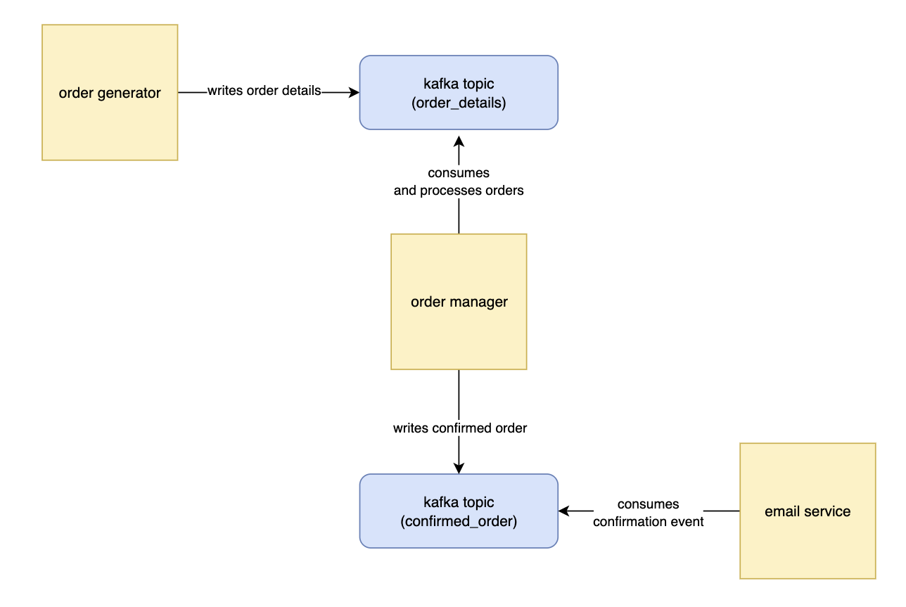

# About

This repo demonstrates an event driven microservices architecture. There are 2 kafka events streams that will be published / consumed by 3 dummy microservices



- When new order is generated, the order details will be published into `order_details` topic
- Order details will be consumed and processed. Once order is confirmed, it will be pulished into `confirmed_order` topic
- Another service will consume `confirmed_order` topic and send confirmation email for each confirmed order

# Run

1. Install requirements
   ```shell
   pip install -r requirements.txt
   ```
2. Spin up kafka server locally
   ```shell
   docker compose up -d
   ```
3. Generate orders
   ```shell
   python services/generate_orders.py
   ```
4. Confirm orders upon consuming orders generated
   ```shell
   python services/confirm_order.py
   ```
5. Send confirmation email upon consuming confirmed orders
   ```shell
   python services/send_confirmation_email.py
   ```
